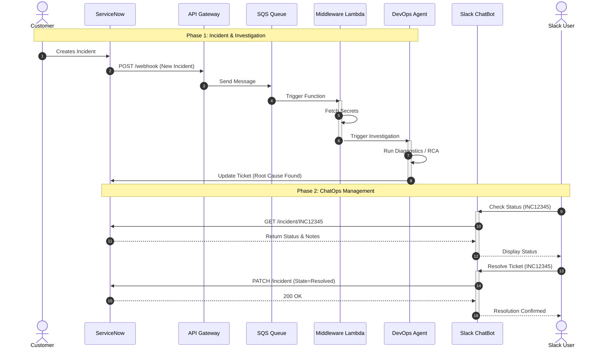

## Architecture Diagram 

```mermaid
sequenceDiagram
    autonumber
    actor Customer
    participant SN as ServiceNow
    participant API as API Gateway
    participant SQS as SQS Queue
    participant MidLambda as Middleware Lambda
    participant Agent as DevOps Agent
    participant ChatBot as Slack ChatBot
    actor User as Slack User

    Note over Customer, Agent: Phase 1: Incident & Investigation
    Customer->>SN: Creates Incident
    SN->>API: POST /webhook (New Incident)
    API->>SQS: Send Message
    SQS->>MidLambda: Trigger Function
    activate MidLambda
    MidLambda->>MidLambda: Fetch Secrets
    MidLambda->>Agent: Trigger Investigation
    deactivate MidLambda
    activate Agent
    Agent->>Agent: Run Diagnostics / RCA
    Agent->>SN: Update Ticket (Root Cause Found)
    deactivate Agent

    Note over User, SN: Phase 2: ChatOps Management
    User->>ChatBot: Check Status (INC12345)
    activate ChatBot
    ChatBot->>SN: GET /incident/INC12345
    SN-->>ChatBot: Return Status & Notes
    ChatBot-->>User: Display Status
    deactivate ChatBot

    User->>ChatBot: Resolve Ticket (INC12345)
    activate ChatBot
    ChatBot->>SN: PATCH /incident (State=Resolved)
    SN-->>ChatBot: 200 OK
    ChatBot-->>User: Resolution Confirmed
    deactivate ChatBot
```