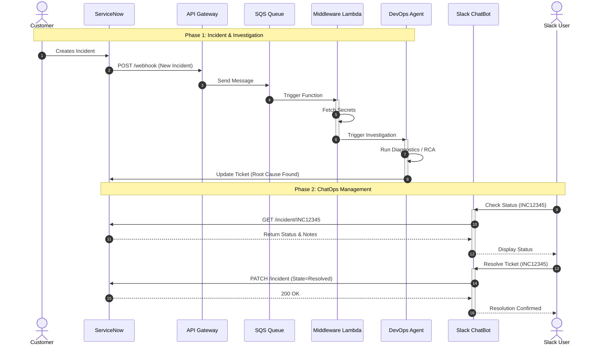
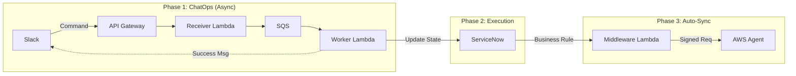

ChatOps: Slack, servicenow - aws devops agent, serverless (lambda) middleware 

## Run

  - [Purpose:](#purpose)
  - [Architecture Design](#architecture-design)
  - [🚀 Implementation Guide](#-implementation-guide)
      - [Phase 1: AWS Configuration](#phase-1-aws-configuration)
      - [Phase 2: ServiceNow Implementation](#phase-2-servicenow-implementation)
      - [Phase 3: Slack Implementation](#phase-3-slack-implementation)
  - [Future work](#future-work)
  - [Troubleshoot](#troubleshoot)

### Purpose

A full-cycle "AIOps" integration: Detection (ServiceNow) → Investigation (AWS Agent) → Remediation/Closure (Slack ChatOps). 
This project helps investiagting the raised incidents in SNOW, and resolving the ticket using slack.

### Architecture Design

### Data Flow

***Slack → API Gateway:***
Slacks sends the payload to the API Gateway.

***API Gateway → Receiver Lambda:***
This means API Gateway passes the request directly to the Lambda function.

***Receiver Lambda → SQS:***
Receiver Lambda: Verifies Slack signature, pushes message to SQS, and responds immediately ("Processing request...")

***SQS → Worker Lambda:***
SQS (Buffers commands during spikes) sends the messages as events to the Lambda function. 
Worker Lambda: Picks up messages from the queue and does the heavy lifting (calling ServiceNow).
Worker Lambda sends the final "***Success***" message back to Slack.

***Slack Callback (response_url):***

Since the Receiver already replied "200 OK", the Worker can't "reply" to the original request.

Instead, Slack sends a special URL (response_url) in the payload. The Worker uses this URL to post the final "Success" message back to the chat.

### 🚀 Implementation Guide

#### Phase 1: AWS Configuration

#### Phase 2: ServiceNow Implementation

#### Phase 3: Slack Implementation

Step 1: Create the Slack App
We need a "dummy" app in Slack to listen for your command.

Go to api.slack.com/apps and click Create New App.

Select From scratch.

App Name: OpsBot.

Workspace: Select your workspace.

Basic Information:

Scroll down to App Credentials.

Copy the "Signing Secret". (You will need this for the Lambda).

Step 2: Expose via API Gateway
Slack needs a public URL to send the command to.

In your Lambda function, go to the Configuration tab.

Select Triggers > Add trigger.

Select API Gateway.

Intent: Create a new API.

API type: HTTP API.

Security: Open (Slack handles security via the Signature we implemented).

Click Add.

Copy the "API Endpoint" URL. (It looks like https://xyz...amazonaws.com/default/SlackToServiceNowBot)

Step 4: Finish Slack Configuration
Go back to your Slack App dashboard.

Click Slash Commands (Sidebar) > Create New Command.

Command: /ops-resolve

Request URL: Paste your API Gateway URL from Step 3.

Short Description: Resolve a ServiceNow incident.

Usage Hint: [incident_number]

Click Save.

Important: Click Install App (Sidebar) > Install to Workspace.

Step 5: Test

Slack: Type /ops-resolve INC12345.

Slack Response: "✅ Success! INC12345 has been Resolved."
ServiceNow: Refresh the ticket.
Status: Should be Closed/Resolved.