# ChatOps: Slack, ServiceNow & AWS DevOps Agent


## 📋 Table of Contents
- [Purpose](#purpose)
- [Architecture Design](#architecture-design)
- [Data Flow](#data-flow)
- [Implementation Guide](#-implementation-guide)
  - [Prerequisites](#prerequisites)
  - [Phase 1: AWS Configuration](#phase-1-aws-configuration)
  - [Phase 2: ServiceNow Implementation](#phase-2-servicenow-implementation)
  - [Phase 3: Slack Implementation](#phase-3-slack-implementation)
- [Future Work](#future-work)
- [Troubleshoot](#troubleshoot)

## Purpose
A full-cycle "AIOps" integration: **Detection** (ServiceNow) → **Investigation** (AWS Agent) → **Remediation/Closure** (Slack ChatOps).

This project helps in investigating raised incidents in ServiceNow automatically and resolving tickets directly using Slack commands.

## Architecture Design

```mermaid
sequenceDiagram
    autonumber
    actor Customer
    participant SN as ServiceNow
    participant AWS_SN as AWS Ingest (API+SQS)
    participant MidLambda as Middleware Lambda
    participant Agent as DevOps Agent
    
    actor User as Slack User (Human)
    participant Slack
    participant AWS_Chat as AWS Chat Stack (API+SQS)
    participant Worker as Worker Lambda

    Note over Customer, Agent: Phase 1: Automated Investigation
    Customer->>SN: Creates Incident
    SN->>AWS_SN: POST /webhook
    AWS_SN->>MidLambda: Trigger via SQS
    activate MidLambda
    MidLambda->>Agent: Start Investigation
    deactivate MidLambda
    
    activate Agent
    Agent->>Agent: Analyze Logs & Suggest Fixes
    Note right of Agent: Agent updates AWS Dashboard
    deactivate Agent

    Note over User, Worker: Phase 2: Human Decision (ChatOps)
    User->>User: Reviews Agent Findings
    User->>Slack: /ops-resolve INC123
    Slack->>AWS_Chat: POST Command
    AWS_Chat-->>Slack: "Processing..."
    
    AWS_Chat->>Worker: Trigger via SQS
    activate Worker
    Worker->>SN: PATCH /incident (Resolved)
    SN-->>Worker: 200 OK
    Worker->>Slack: POST Result
    deactivate Worker
    Slack-->>User: "✅ Resolution Confirmed"
```




### Data Flow


**Logic Explanation**
***Slack → API Gateway:*** Slack sends the payload (command) to the API Gateway.

***Receiver Lambda:*** Verifies the Slack HMAC signature for security, pushes the message to SQS, and responds immediately with "Processing..." to prevent Slack timeouts.

***SQS Buffer:*** Buffers commands during traffic spikes to ensure no requests are dropped.

***Worker Lambda:*** Picks up messages from the queue, performs the API call to ServiceNow (Resolution), and sends the final Success message back to Slack via the response_url.

### Implementation Guide

#### Prerequisites
- AWS CLI & CDK installed.
- Python 3.12+ and uv installed.
- ServiceNow Developer Instance.

#### Phase 1: AWS Configuration
1. Configure AWS DevOps Agent 🤖

    - Navigate to AWS Console → DevOps Agent.
    - Create a Generic Webhook.
    - Save the Webhook URL and Secret Key.

2. Deploy Resources
```
git clone [https://github.com/sree7k7/ChatOps-ServiceNow-DevOps-Agent-Integration.git](https://github.com/sree7k7/ChatOps-ServiceNow-DevOps-Agent-Integration.git)
uv sync
cdk deploy
```
**Note:** Save the output script/URL from the terminal; you will need this for the ServiceNow Business Rule.

3. 🔐 Secrets Manager Setup The CDK creates a placeholder secret. You must update it manually.

    - Go to AWS Console > Secrets Manager.
    - Find the secret named SlackToSnowBotSecret.
    - Click Retrieve Secret Value → Edit.
    - Replace the JSON with your actual credentials:
```json
{
  "slack_signing_secret": "YOUR_SLACK_SIGNING_SECRET",
  "sn_instance": "dev12345",
  "sn_user": "admin",
  "sn_pass": "YOUR_SERVICENOW_PASSWORD"
}
```

#### Phase 2: ServiceNow Implementation
1. Access Instance: Log in to your ServiceNow Developer Portal.

2. Create Business Rule:

    - Navigate to System Definition → Business Rules.
    - Click New.
    - Name: Notify AWS DevOps Agent.
    - Table: Incident [incident].
    - When: After (Insert/Update).
    - Advanced: Paste the script provided in the CDK Output.

#### Phase 3: Slack Implementation
1. Create App: Go to api.slack.com/apps → Create New App (From Scratch) → Name it OpsBot.

2. Credentials: Copy the Signing Secret (Basic Information tab).

3. Slash Command:
    - Go to Slash Commands → Create New Command.
    - Command: `/ops-resolve`
    - Request URL: Paste your API Gateway URL (from CDK Output).
    - Usage Hint: `INC12345`
    - Install: Click Install App to Workspace.
4. Install: Click Install App to Workspace.

✅ Testing
1. Slack: Type /ops-resolve INC12345.
2. Response: You should see "⏳ Processing..." followed by "✅ Success!".
3. ServiceNow: The ticket state should change to Resolved.